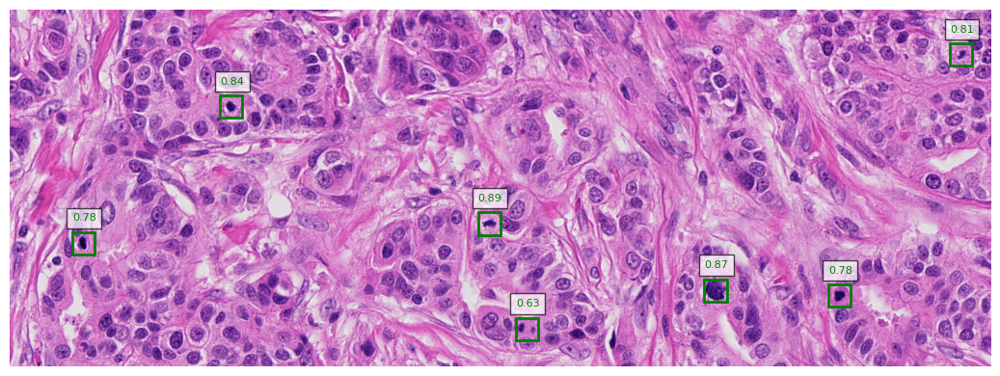

# FCOS Inference CLI

A simple command-line interface (CLI) application for performing mitotic figure object detection on microscopy images using trained models. This tool supports both single image and batch processing, with configurations for whole slide images (WSIs) and regular images (e.g. ROIs). It is built using [Typer](https://typer.tiangolo.com/) for a user-friendly interface and leverages PyTorch models for inference.

## Features 
- **Single Image Inference**: Perform object detection on a single image.
- **Batch Inference**: Process a folder of images and save results for each image.
- **Whole Slide Image (WSI) Support**: Handle large WSI files with patch-based processing.
- **Customizable Parameters**: Configure batch size, device (CPU/GPU), patch size, overlap, and more.
- **JSON Results**: Save detection results for each image in JSON format.

## Models 
There are three models available. All three models are based on the [FCOS](https://arxiv.org/abs/1904.01355) implementation provided by torchvision. All three models were trained on the [MIDOG++](https://www.nature.com/articles/s41597-023-02327-4) dataset and tested on the official [MIDOG 2022](https://www.sciencedirect.com/science/article/pii/S136184152400080X) test set. 

The table below summarizes the results on the results on the MIDOG 2022 test set:

| Detector | Backbone         | F1     | Precision | Recall |
|----------|------------------|--------|-----------|--------|
| FCOS     | ResNet18         | 0.7369 | 0.7950    | 0.6868 |
| FCOS     | ResNext50_32x4d  | 0.7492 | 0.8035    | 0.7017 |
| FCOS     | ResNext101_32x8d | 0.7528 | 0.7906    | 0.7184 |


## Installation

Clone the repository, create a virtual enviroment and install the dependencies. 

 ```bash
git clone git@github.com:jonas-amme/FCOS_Inference_CLI.git
cd FCOS_Inference_CLI
python3 -m venv env
source env/bin/activate
pip install -r requirements.txt
```


## Usage

The CLI provides two main commands: `detect` and `validate-config`.

### 1. `detect`

Perform object detection on a single image or a folder of images.

#### Command Syntax:
```bash
python main.py detect CONFIG_PATH INPUT_PATH OUTPUT_DIR [OPTIONS]
```

#### Arguments:
- `CONFIG_PATH`: Path to the model configuration YAML file.
- `INPUT_PATH`: Path to the input image or directory containing images.
- `OUTPUT_DIR`: Directory to save detection results.

#### Options:
- `--wsi`: Process whole slide images (WSI). Default is `False`.
- `--batch-size, -b`: Batch size for inference. Default is `8`.
- `--workers, -w`: Number of worker processes for data loading. Default is `4`.
- `--device, -d`: Device to use for inference (`cuda` or `cpu`). Default is `cuda` if available.
- `--patch-size, -p`: Size of image patches for WSI processing. Default is `1024`.
- `--overlap, -o`: Overlap between patches (0-1). Default is `0.3`.

#### Examples:
- **View detect Options**
  ```bash
  python main.py detect --help
  ```

- **Single Image Inference**:
  ```bash
  python main.py detect configs/FCOS_18.yaml path/to/rois/roi_001.tif output_dir/
  ```

- **Batch Inference on Regular Images**:
  ```bash
  python main.py detect configs/FCOS_18.yaml path/to/rois output_dir/
  ```

- **Batch Inference on WSI Images**:
  ```bash
  python main.py detect configs/FCOS_18.yaml path/to/wsis output_dir/ --wsi
  ```


### 2. `validate-config`

Validate a model configuration file to ensure it is correctly formatted and compatible.

#### Command Syntax:
```bash
python main.py validate-config CONFIG_PATH
```

#### Arguments:
- `CONFIG_PATH`: Path to the model configuration YAML file.

#### Example:
```bash
python main.py validate-config configs/FCOS_18.yaml
```


## Configuration File Format

The model configuration file is a YAML file that specifies the parameters for the model. Below is an example configuration:

```yaml
model_name: "faster_rcnn_resnet50"
detector: "FasterRCNN"
backbone: "resnet50"
checkpoint: "path/to/checkpoint.ckpt"
det_thresh: 0.5
num_classes: 2
extra_blocks: False
weights: "path/to/weights.pth"
returned_layers: [2, 3, 4]
patch_size: 1024
```

### Key Parameters:
- `model_name`: Name of the model.
- `detector`: Type of detector (e.g., `FasterRCNN`, `RetinaNet`, `MaskRCNN`, `FCOS`).
- `backbone`: Backbone architecture (e.g., `resnet50`).
- `checkpoint`: Path to the model checkpoint file.
- `det_thresh`: Detection confidence threshold.
- `num_classes`: Number of object classes.
- `extra_blocks`: Whether to use extra FPN blocks.
- `weights`: Path to pretrained weights (optional).
- `returned_layers`: Specific layers to return from the backbone (optional).
- `patch_size`: Size of input patches (for WSI processing).


## Output

The detection results are saved in JSON format for each image in the specified output directory. Each JSON file contains:
- `boxes`: Bounding box coordinates for detected objects.
- `scores`: Confidence scores for each detection.
- `labels`: Class labels for each detection.
- `image_path`: Path to the processed image.

Example JSON output:
```json
{
  "boxes": [[100, 200, 150, 250], [50, 60, 100, 120]],
  "scores": [0.95, 0.85],
  "labels": [1, 2],
  "image_path": "input_image.jpg"
}
```


## Supported File Types

### Regular Images:
- `.tif`, `.tiff`, `.jpg`, `.jpeg`, `.png`

### Whole Slide Images (WSI):
- `.svs`, `.tif`, `.tiff`, `.dcm`, `.vms`, `.ndpi`, `.vmu`, `.mrxs`, `.czi`


## License

This project is licensed under the MIT License. See the [LICENSE](LICENSE) file for details.


## Acknowledgments

- Built with [Typer](https://typer.tiangolo.com/) for CLI functionality.
- Powered by [PyTorch](https://pytorch.org/) for deep learning inference.
- Uses [Rich](https://rich.readthedocs.io/) for beautiful terminal output.

